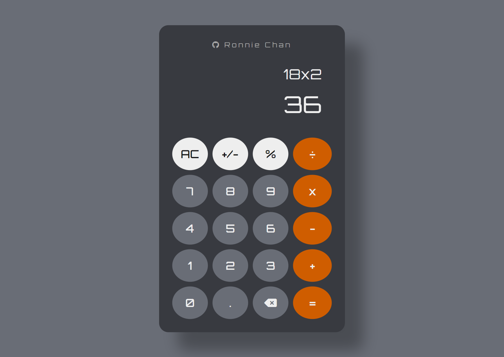

# Calculator

[](https://github.com/chanronnie/the-odin-project)
[](https://chanronnie.github.io/the-odin-project/calculator/)



## About this project

The goal of this project is to build a simple calculator using JavaScript. It performs basic arithmetic operations and computes only two numbers at a time. The app is fully responsive on different screen sizes.

<br>

[](https://chanronnie.github.io/the-odin-project/calculator/)

## Features

### Calculator Features

- Basic arithmetic operations handling two numbers at a time
- Ability to `chain calculations` to use previous result
- Decimal `.` button to create floating-point numbers
- Sign `+/-` button to toggle the number’s sign
- `Percent `%` button for quick percentage operations (e.g., 20 + 15% = 20 + (20 \* 0.15) = 23)
- `Backspace` button to erase the last input
- Clear `AC` button to reset the app
- Math and syntax error handling for edge cases

### Coding Features

- CSS Flexbox and Grid for arranging HTML elements
- Event handlers for button clicks to capture user inputs
- Event handlers for keyboard inputs
- Media queries for a flexbile experience accross different screen sizes

## Approach

In the [index.html](./index.html), rather than writing the buttons exactly as they are displayed in a typical calculator, I decided to challenge myself by structuring the HTML _semantically_ and refining my CSS skills 🚀.

```html
<main>
  <section class="controls">
    <!-- button elements -->
  </section>

  <section class="operators">
    <!-- button elements -->
  </section>

  <section class="operands">
    <button value="1">1</button>
    <button value="2">2</button>
    <button value="3">3</button>
    <!-- etc. -->
  </section>
</main>
```

- I grouped the buttons within `<section>` tags based on their function (`controls`, `operators`, and `operands`).
- The number buttons are displayed in ascending order.
- Using CSS Flexbox and Grid, I arranged the buttons into the desired layout.

## Technologies

   

## 🚀Growth and Next Steps

**Current Performance:** My current algorithm handles most edge cases (syntax errors, math errors, chaining calculations). However, the calculator can only compute two numbers at a time. Here are some improvements I plan to implement:

- Enhance the JavaScript algorithm for better code structure and logic
- Support operations with more than two numbers and introduce parentheses
- Add scientific calculations
- Refine media queries for an even better responsive design on various screen sizes

## Licence

&copy; 2024 - This project is licensed under the [MIT License](./LICENSE).
