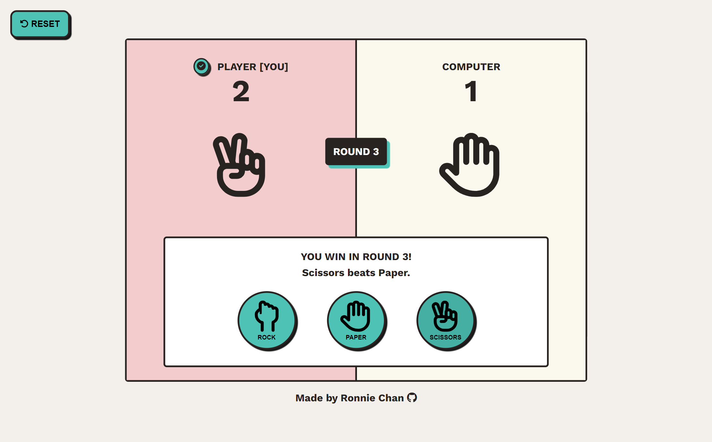
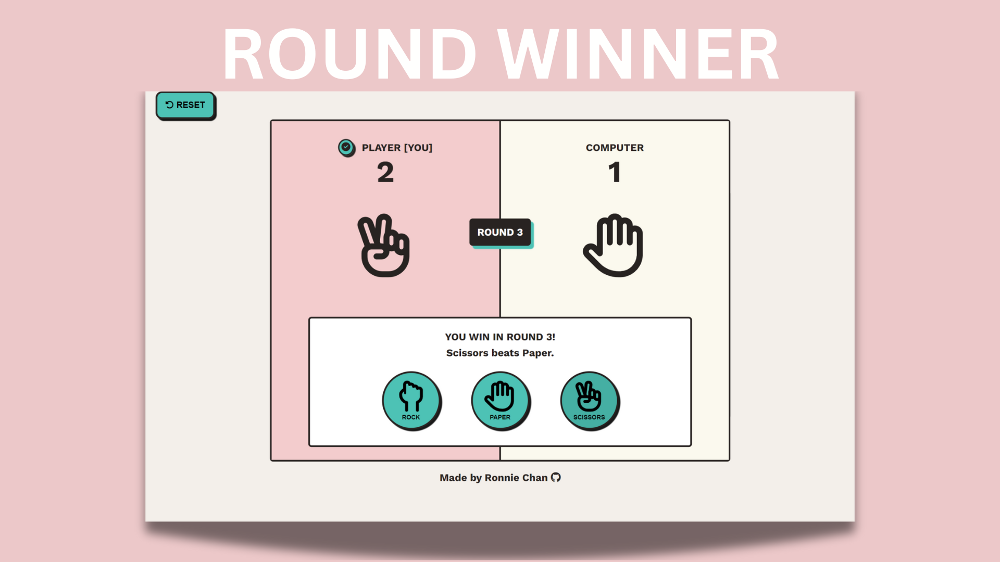
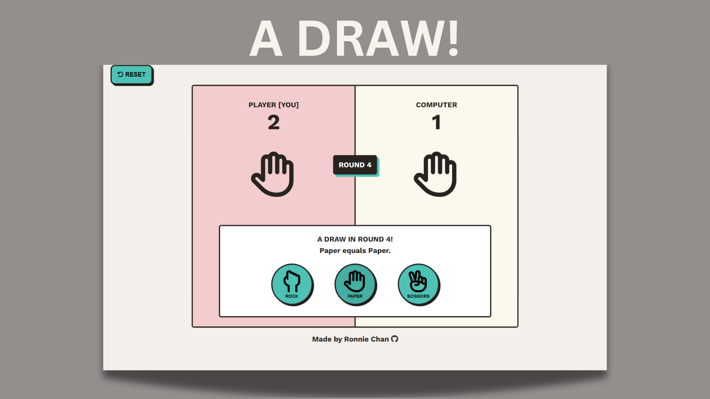
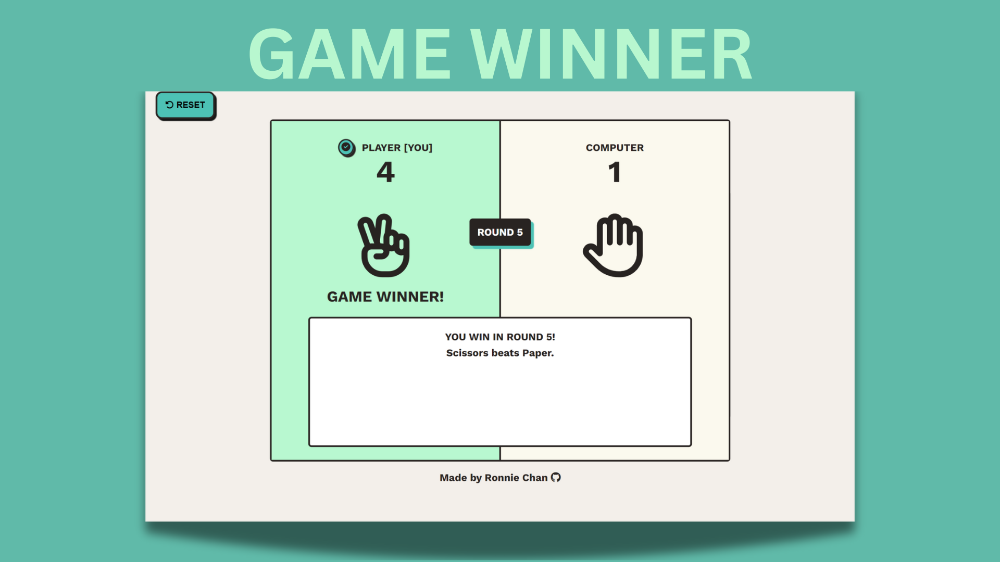

# Rock Paper Scissors

## About this project

The goal of this project is to build a rock-paper-scissors game using HTML, CSS, and JavaScript. The game features simple setups for winning, and is designed with a **Neo—Brutalism** style. The main challenge in this project is writing the game logic in JavaScript and managing setup changes synchronously using DOM manipulations.

 

## Rules

- The game consists of 5 rounds.
- The human player has 3 options to battle against the computer: rock, paper, and scissors.
- Move selections are displayed as images in the button elements.
- Winning rules are the following:
  - Rocks beats Scissors.
  - Paper beats Rock.
  - Scissors beat Paper.
- If both players choose the same move, it's a draw, and the round is replayed until a winner is determined.
- The player with the highest score at the end of round 5 wins the game.
- The game winner is announced at the end of round 5.

## Features

- CSS Flexbox and Positioning for layout
- Multiple game setups for win/tie scenarios
- Winner dot next to the round winner
- DOM manipulation for interactive elements

## Technologies

   

## Image Credits

- **Icons**: This project uses icons from [Font Awesome](https://fontawesome.com/).
- **SVG Images**: This project uses SVG images from [Font Awesome](https://fontawesome.com/).

> 📝 **Naming Conventions**: For CSS styling purposes, two versions of images for the moves are included. The `paper.svg` has a ligther shade compared to the `btn-paper.svg`. Images starting with "btn" have a darker tone.

## Screenshots

Below are previews of the different game setups.  

## Licence

&copy; 2024 - This project is licensed under the [MIT License](./LICENSE).
